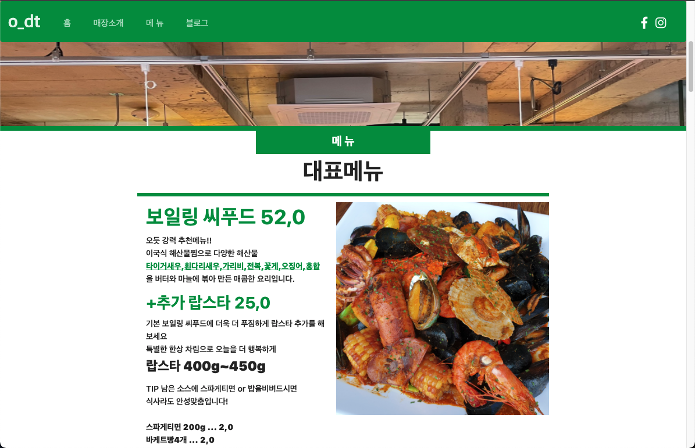
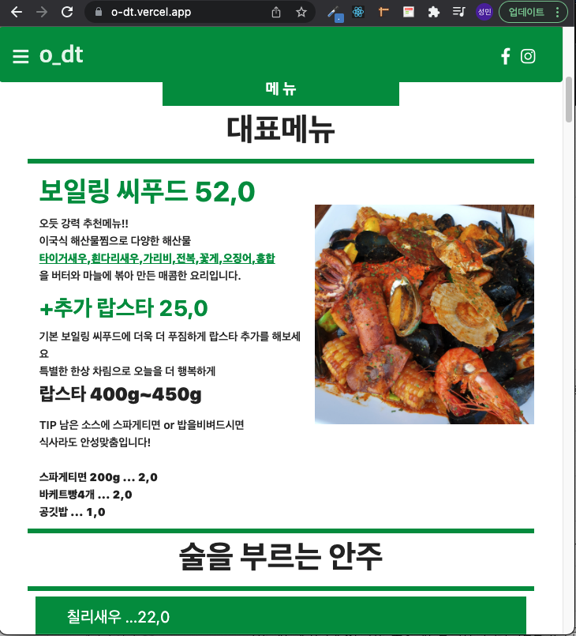
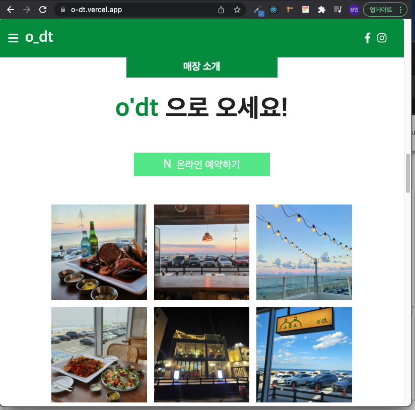
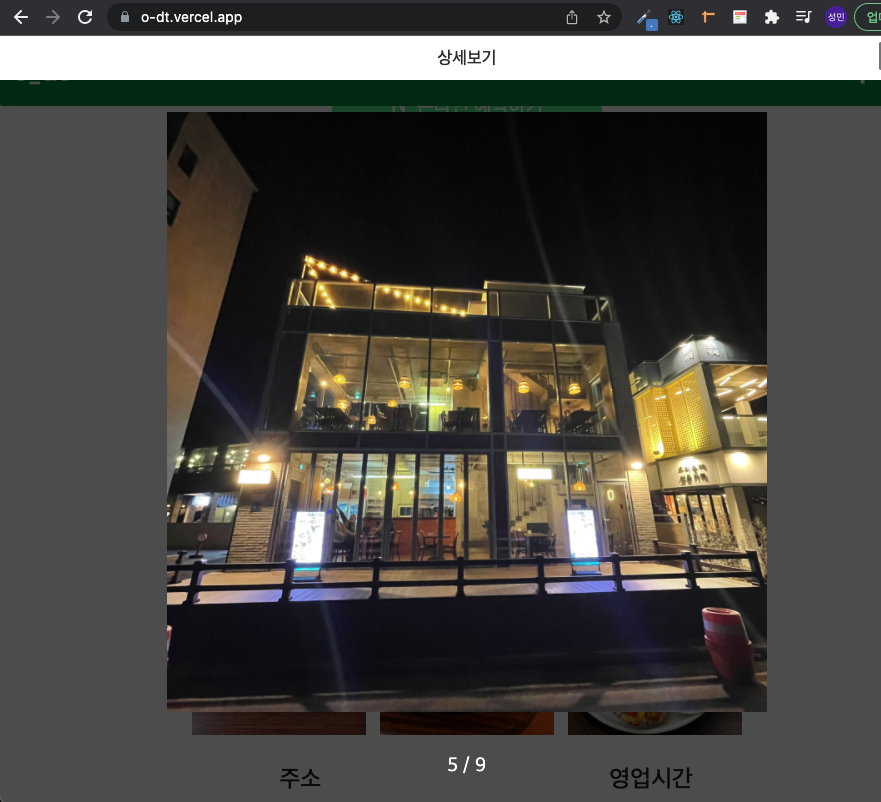
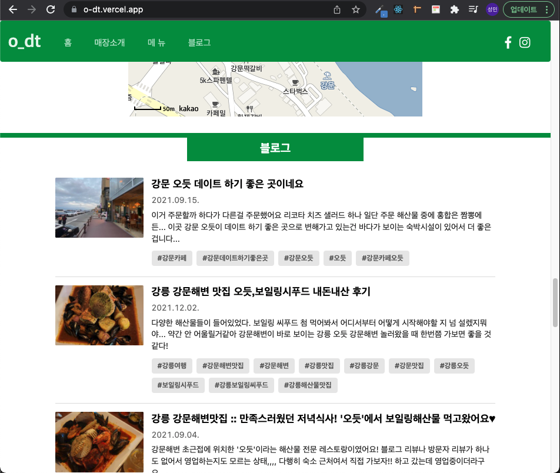
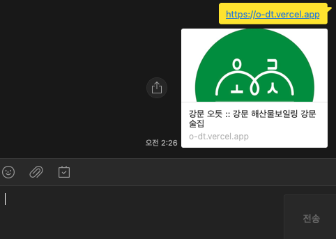

# 강문 오듯 보일링 해산물 식당 웹페이지 제작 ver 2.0

    친누나가 운영하는 식당입니다 무료로 개발해 주면서 처음 배운 Next.js 에 많은 연습이 된거 같습니다.

## 사이트주소: https://o-dt.vercel.app

## 기술스택:

    
    
    
    
    
    

### 클라이언트 서버 배포:

### 클라이언트 배포:

## ver 2.0 개선점:

1. next.js 프레임워크 장점을 활용하여 검색엔진 최적화:
   > 결국 사람들이 사용해야 하는 사이트이기 때문에 사이트에 노출이 되어야 한다고 생각해서 Next.js 서버사이드렌더링 장점을 살려서 검색엔진 최적화(SEO)에 큰 공을 들인 프로젝트 입니다.
2. 반응형 웹 구현:
   > 웹 넓이 사이즈에 따라서 헤더 네비바, 컨텐츠 위치를 적절히 재 배치 하여 반응형 효과를 줬습니다.
   >  
3. 상세사진 배치 개선 react-slick 라이브러리 를 사용하여 이미지 클릭 했을때 확대가능 구현해서 옆으로 스와이프 가능하게 했습니다.
   > 
   > 확대:
   > 
4. 네이버 open API 를 통해서 식당 관련 블로그를 긁어올려고 했으나 받아오는 객체안에 정보들이 너무 부족해서 직접 웹을 크롤링해서 블로그 정보를 가져와서 구혔했다.
   > 
5. 오픈그래프 메타태그 를 활용하여 kakaotalk 등에 링크 띄우면 사진과 간단한 소개 나오게끔 구현 했습니다
   > 
